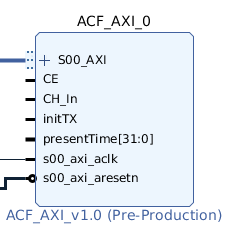
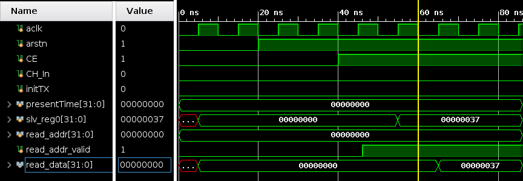

# ACF-AXI
A hardware implementation of an autocorrelation function that conforms to the AXI protocol

## IP

## Current State
So far this is just a dummy IP that looks like the `ACF_AXI` IP will (in terms of inputs and outputs). It has no real functionality yet other than outputting `0x37` to read address 0 when `CE` is high.

## Testing
